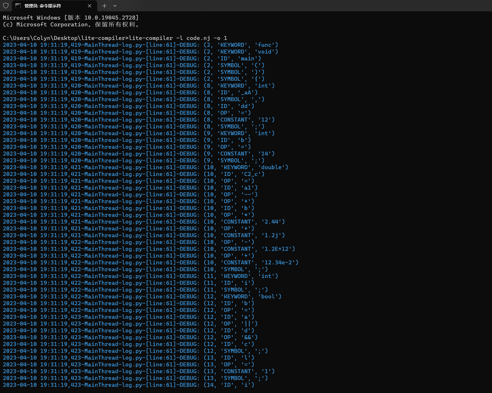
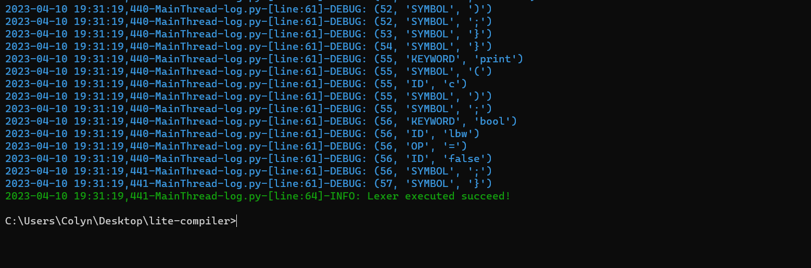
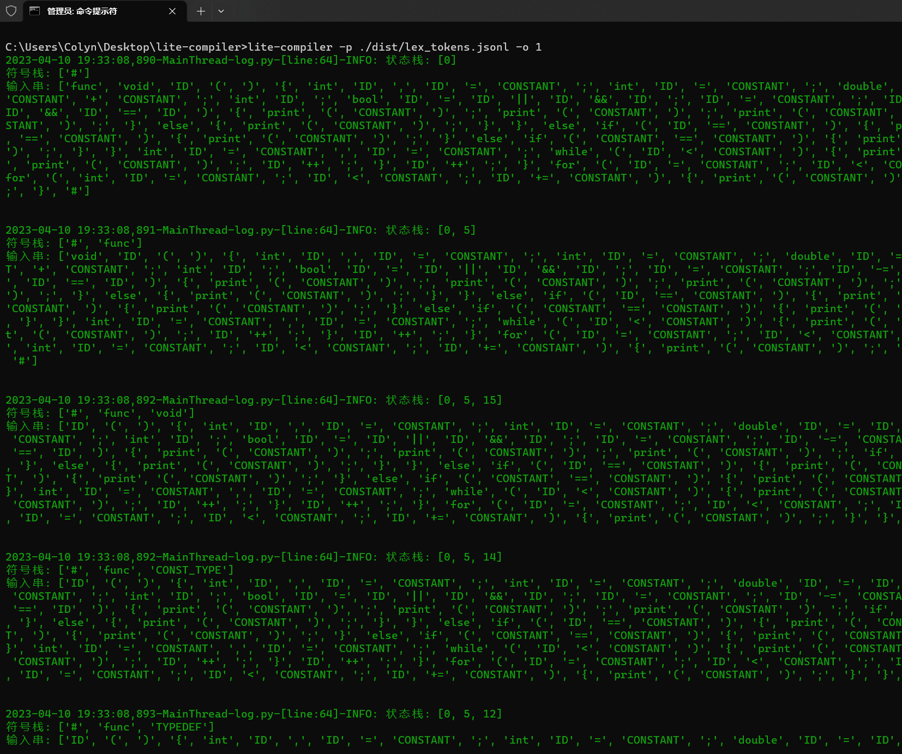
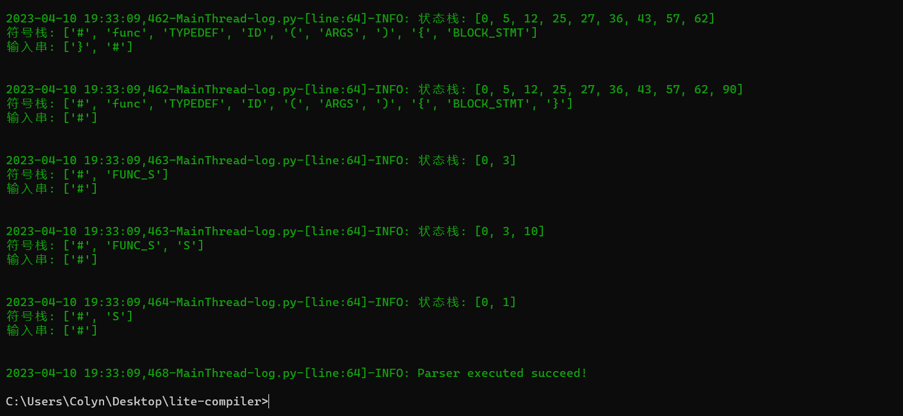
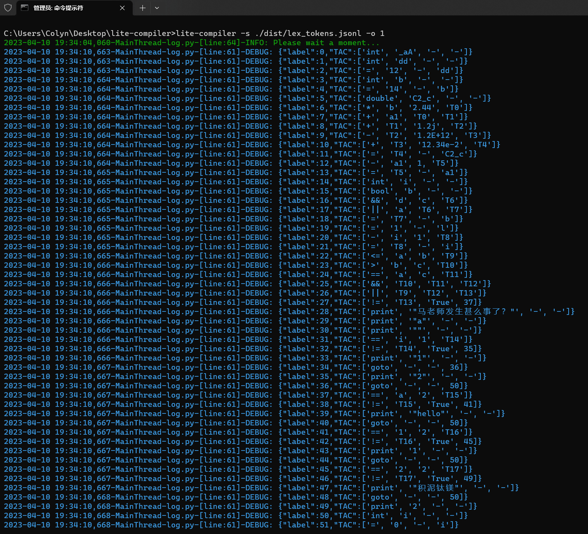
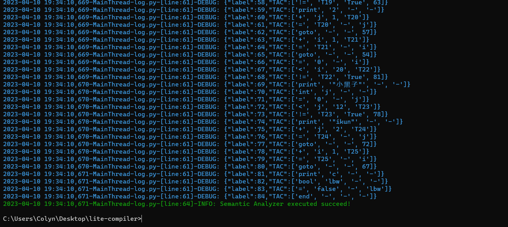

# lite-compiler
 A simple compiler by Python

> A simple and scalable compiler by Python. 

## Intro

A simple lexical parser written in Python that supports grammar parsing for C++-like languages, on which you can extend your grammar rules.

一个由Python编写的简单词法分析器，支持类C++语言的文法解析，你可以在此基础上扩展你的文法规则。


The functions currently implemented and the knowledge used are as follows:

目前实现的功能及所用到的知识如下：


- 词法分析器（Lexical analyzer）
- 语法分析器（Syntax parser)
- 语义分析器（Semantic parser）


The above-mentioned parsers use the knowledge of CFG, LR(1) and TAC, respectively.

上述的解析器分别用到的知识有CFG、LR(1)和TAC等。


## Usage

In the following, we will use the tool to parse the following code:

下面，我们将利用该工具解析如下代码：

```c++

func void main(){
            // 注释
    /*编译器

	*/

    int _aA,dd = 12;
    int b= 14;
    double C2_c = a1-- + b * 2.44 + 1.2j - 1.2E+12 + 12.34e-2;
    int i;
    bool b=a||d&&c;
    l=1;
    i-=1;
    if(a<=b || b>c && a==c){
        print("马老师发生甚么事了？");
        print('a');
        print("");
        if(i==1){
            print("1");
        }
        else{
            print("2");
        }
    }
    else if(a==2){
        print("hello");
    }
    else{
        if(1==2){
            print(1);
        }
        else if(2==2){
            print("积泥钛镁");
        }
        else{
            print(2);
        }
    }
    int i=0,j=0;
    while(i<10){
        print(1);
        while(j<5){
            print(2);
            j++;
        }
        i++;
    }
    for(i=0;i<20;i++){
        print("小黑子");
        for(int j=0;j<12;j+=2){
            print("ikun");
        }
    }
    print(c);
    bool lbw = false;
}
```

可以使用如下的指令实现：

```bash
lite-compiler -l code.nj -o 1 
```




 ```bash
 lite-compiler -p ./dist/lex_tokens.jsonl -o 1
 ```




```bash
lite-compiler -s ./dist/lex_tokens.jsonl -o 1
```



